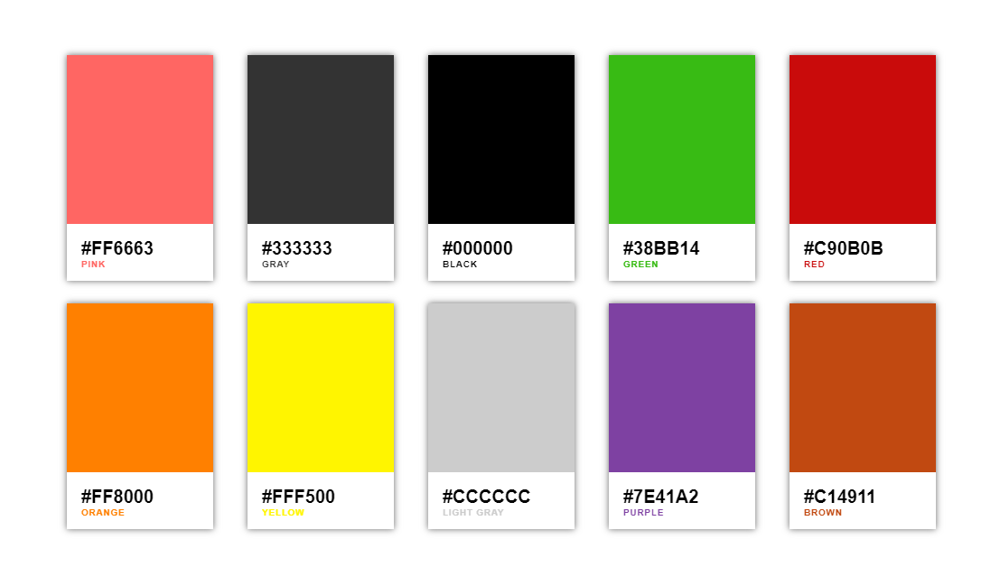

# Create Increment Counter Using React

Should have Knowledge in <br />
1. ES6  <br />
2. React <br />

## Preview


## Explaination

You Can able to set new color-code and relevant color-name from here from here <br />
``` Es6 React Html
 <div className="row">
  <Card colorCode="#FF6663" colorName="PINK"/>
  <Card colorCode="#333333" colorName="GRAY"/>
  <Card colorCode="#000000" colorName="BLACK"/>
  <Card colorCode="#38BB14" colorName="GREEN"/>
  <Card colorCode="#C90B0B" colorName="RED"/>
  <Card colorCode="#FF8000" colorName="ORANGE"/>
  <Card colorCode="#FFF500" colorName="YELLOW"/>
  <Card colorCode="#CCCCCC" colorName="LIGHT GRAY"/>
  <Card colorCode="#7E41A2" colorName="PURPLE"/>
  <Card colorCode="#C14911" colorName="BROWN"/>
</div>
```


## Usefull Links
[Generate Color Names For Color Codes](http://www.htmlcsscolor.com/)

